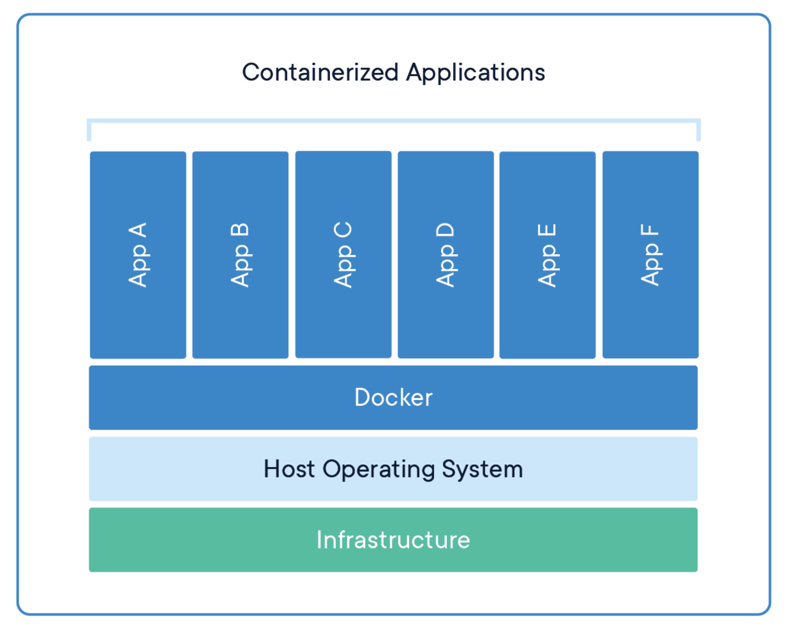
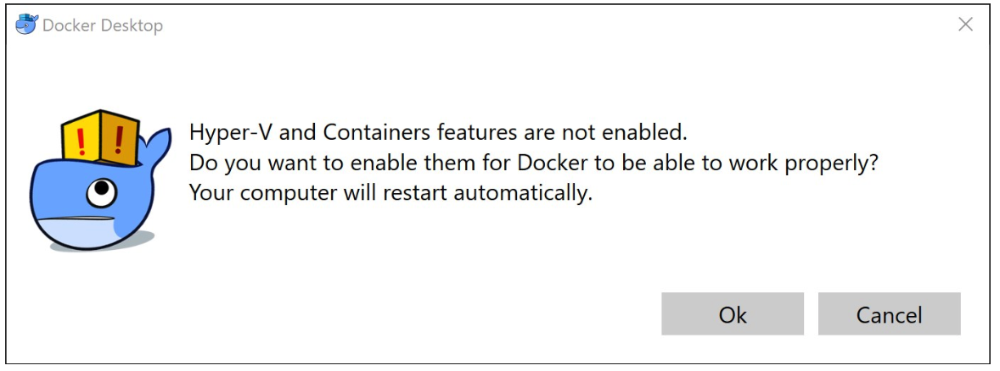
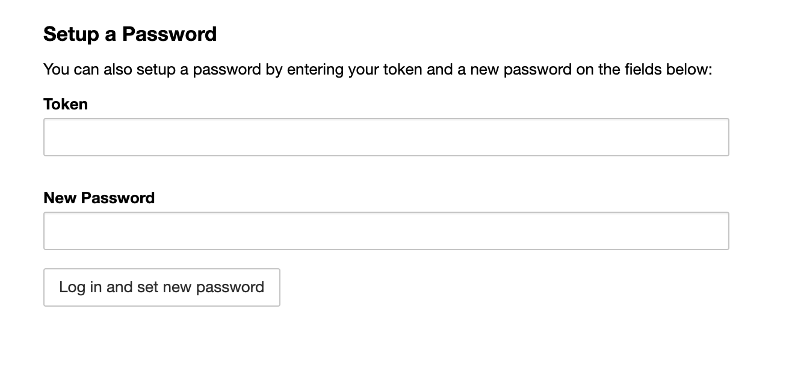
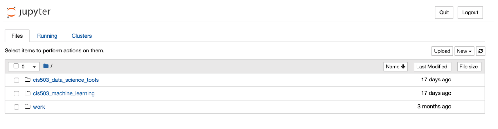
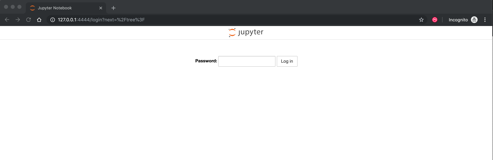
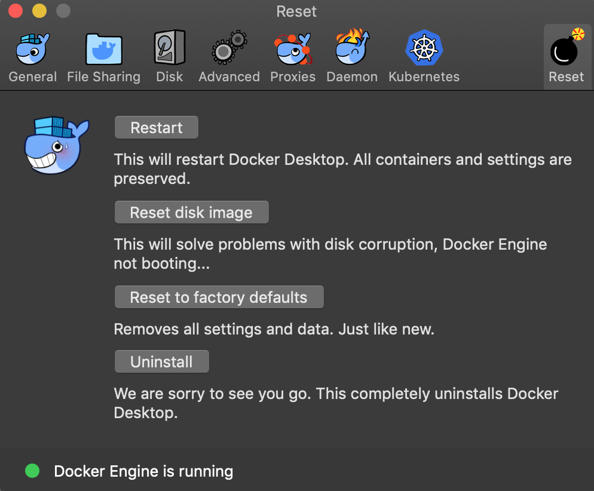

## Introduction to Docker

We are using Docker to manage the environments we are using for the labs in CIS 503. Docker is a technology that is increasingly being used by data scientists to make working together using the same tools and technologies easier. Data scientists use many different technologies. In our class labs, for example, we will use the statistical programming languages R and Python, but we will also use over dozens of different packages and libraries including those for plotting and machine learning. Some of these libraries require very specific set up procedures depending on the operating system. So, when working separately on the same analysis, setting up the same technical environment can be very challenging.

Docker and its associated open source technology allow data scientists and developers to use a common platform to run applications and analyses on desktop computers as well as in cloud services like Google Cloud Platform, Amazon Web Services, and Microsoft Azure. Docker acts as a container for different applications. Docker is also the foundation for scaling up analyses using frameworks like Kubernetes and Pachyderm. Some of the benefits of using Docker for data science are detailed here- [https://www.docker.com/solutions/data-analytics](https://www.docker.com/solutions/data-analytics).


Figure 1. The Docker Environment

<div style="text-align:center"></div>


Note: there is only one lab assignment required for each group, so there is not a requirement that everyone must install and run the lab exercises on their personal computer. While Docker should work for most newer computers, there may be cases where it can’t be installed. Your lab assignment can be completed by working together on a single computer. Some teams find it more effective to use “pair programming” methodologies where one team member is the driver (responsible for typing code) and other team members are navigators (giving the driver instructions on what to do next).

### Installing Docker on your Desktop

1. To get started, you will need to download Docker Desktop on your computer. Docker requires you to set up an account on Docker Hub, but the account is free to set up.
2. The Docker system requirements call for at least 4GB of memory in Windows and Mac OSX:
https://docs.docker.com/docker-for-windows/install/
https://docs.docker.com/docker-for-mac/install/
2. You will also need to make sure Docker is running before you can enter any commands in your terminal. You can either have it start automatically upon boot up or you can manually start it by launching the application.
3. In addition to the system requirements for Docker, you will need at least 6 GB of available storage to download the lab image for our class.

**Windows:**
1. For Windows, Docker Desktop requires Windows 10 64-bit Pro, Enterprise, or Education. Details for Windows installs can be found here- [https://docs.docker.com/docker-for-windows/install/](https://docs.docker.com/docker-for-windows/install/). Windows 10 Home Edition does not support Docker Desktop, but ASU has a program that allows students to upgrade for
free available here- [https://myapps.asu.edu/app/windows-10-home-usage](https://myapps.asu.edu/app/windows-10-home-usage)

2. Depending on your Windows setup, you may have to enable Hyper-V and Containers which requires a restart. Documentation is available here- [https://docs.microsoft.com/en-us/virtualization/hyper-v-on-windows/quick-start/enable-hyper-v](https://docs.microsoft.com/en-us/virtualization/hyper-v-on-windows/quick-start/enable-hyper-v)

<div style="text-align:center"></div>


**Mac OSX:**

1. For Macs, the hardware must be a 2010 or newer model, with Intel’s hardware support for memory management unit (MMU) virtualization, including Extended Page Tables (EPT) and Unrestricted Mode. macOS Sierra 10.12 and newer macOS releases are supported.  Installation instructions are here- [https://docs.docker.com/docker-for-mac/install/](https://docs.docker.com/docker-for-mac/install/)

### Getting and Running the CIS503 Docker Image

The primary way to interact with Docker is via a terminal window (command line). There are only a few commands you need to use to install and use the CIS503 environment.

1. Download the CIS503 image. After you install and start Docker Desktop, the first step is to download (called “pull” in Docker terms) the class image from Docker hub. The image we will use for class is publicly available from the Docker cloud. The repository page for this image is: [https://hub.docker.com/r/azbones/cis503](https://hub.docker.com/r/azbones/cis503). In order to download the image, you will need to open up a terminal window on your computer.

**In Windows**, you can use can use PowerShell for your terminal. Details about it are here- [https://docs.microsoft.com/en-us/powershell/scripting/getting-started/getting-started-with-windows-powershell](https://docs.microsoft.com/en-us/powershell/scripting/getting-started/getting-started-with-windows-powershell)

**In Mac OSX**, you can use terminal. Details about it are here- [https://support.apple.com/guide/terminal/welcome/mac](https://support.apple.com/guide/terminal/welcome/mac)

To download the CIS 503 image, in your terminal window, type the following:

`docker pull azbones/cis503`

The first time you download the image, it will take several minutes depending on your computer speed and the speed of your Internet connection. Given the image is large, try to set aside time to do this when you have a fast and high quality connection like on campus. When the image has been downloaded successfully, you should see a status message similar to the following:

```
Digest: a very long alphanumeric string
Status: Downloaded newer image for azbones/cis503:latest
```

You can list all the Docker images on your computer with the following command:

`docker image ls`

After you have downloaded the class image, you should see an output similar to the following when you run the “image” command:

```
REPOSITORY     TAG         IMAGE ID       CREATED        SIZE
azbones/cis503 latest      8d85a0b62612   2 weeks ago    5.55GB
```

2. Run the CIS503 docker image. Once you have docker running on your computer and have downloaded the CIS503 image, you can run the environment. The environment includes Jupyter Notebook and all of the statistical software and libraries we will use in the lab.
3. Start the Jupyter environment.  To start the environment, type the following command in your terminal window:

`docker run -p 4444:8888 --name cis503 azbones/cis503`

You should see output similar to the following:

```
Executing the command: jupyter notebook
[I 23:02:05.305 NotebookApp] Writing notebook server cookie secret to /home/jovyan/.local/share/jupyter/runtime/notebook_cookie_secret
[I 23:02:06.522 NotebookApp] JupyterLab extension loaded from /opt/conda/lib/python3.7/site-packages/jupyterlab
[I 23:02:06.522 NotebookApp] JupyterLab application directory is /opt/conda/share/jupyter/lab
[I 23:02:06.524 NotebookApp] Serving notebooks from local directory: /home/jovyan
[I 23:02:06.524 NotebookApp] The Jupyter Notebook is running at:
[I 23:02:06.524 NotebookApp] http://(c582c1105517 or 127.0.0.1):8888/?token=7defdce4488403502b1f400358f56985e5aada3b82961ee0
[I 23:02:06.524 NotebookApp] Use Control-C to stop this server and shut down all kernels (twice to skip confirmation).
[C 23:02:06.528 NotebookApp]

  To access the notebook, open this file in a browser:
    file:///home/jovyan/.local/share/jupyter/runtime/nbserver-6-open.html
  Or copy and paste one of these URLs:
    http://(c582c1105517 or 127.0.0.1):8888/?token=7defdce4488403502b1f400358f56985e5aada3b82961ee0
```

4. Open the local server URL in your web browser. To open your Jupyter Notebook, you need to open the URL [http://127.0.0.1:4444](http://127.0.0.1:4444) in your web browser. Google’s Chrome browser is recommended. The web page will require you to enter the token from the output in your terminal into the field on the Jupyter login page.

5. Cut and paste the token from your terminal output into the "Token” field under the "Setup a Password" section at the bottom. Enter a password that you will remember in the "New Password" field and press "Log in and set new password". In this case the token is “7defdce4488403502b1f400358f56985e5aada3b82961ee0”. Make sure you only use the token and not any spaces or other characters from the output. *Don't close your terminal window. When you are finished using your notebooks, you can go back to the terminal and press `control-c` to stop your environment.*

<div style="text-align:center"></div>

5. Open the Jupyter Notebook. We will run through the lab as a class, but you can check to make sure everything is working by clicking into the web links like “cis503_data_science_tools”.

<div style="text-align:center"></div>

6. You can stop docker by hitting `control-c` in your terminal window or typing `docker stop cis503` in a terminal window.

7. If you want to start the docker container again after you stop it, navigate to your terminal and enter `docker start cis503` and then navigate to [http://127.0.0.1:4444](http://127.0.0.1:4444) where you will have to enter the password you provided the first time you logged in.

<div style="text-align:center"></div>

### Uninstall Docker

If you would like to uninstall Docker and the CIS 503 environment, open the Docker application and navigate to the "reset" menu and select "uninstall".

<div style="text-align:center"></div>
